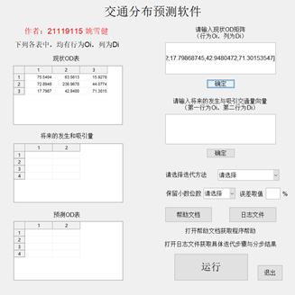
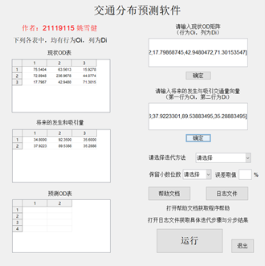
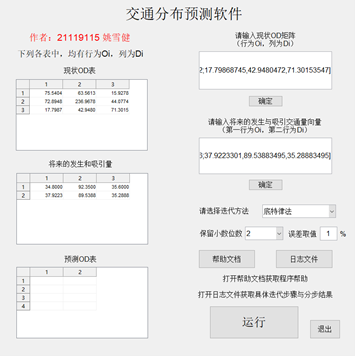
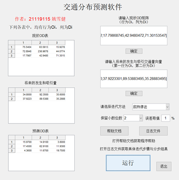
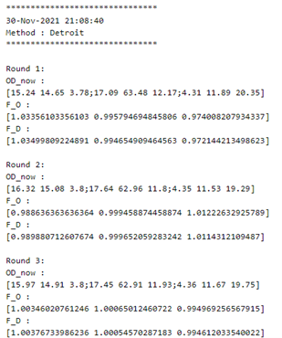

# Traffic_distribution_forecast_GUI_matlab

<b>交通分布预测软件操作介绍</b>

<b>21119115 姚雪健</b>

1、输入matlab格式现状矩阵。点击下方“确定”按钮在左侧显示现状OD矩阵。

图1 现状OD矩阵添加

2、输入未来的生成和吸引交通量向量，第一行为生成向量，第二行为吸引向量。点击下方“确定”按钮在左侧显示未来的生成和吸引交通量向量。

图2 未来的生成和吸引交通量向量添加

3、选择迭代方法、保留小数位数和误差大小。

图3 参数选择

4、点击“帮助文档”按钮可查看帮助文档。

5、点击“运行”按钮在左侧显示最终迭代得到的未来OD表，点击上方的“日志文件”按钮即可查看.log文件中的每次迭代的具体过程。

图4 结果输出

图5 日志文件

6、点击“退出”按钮退出。
